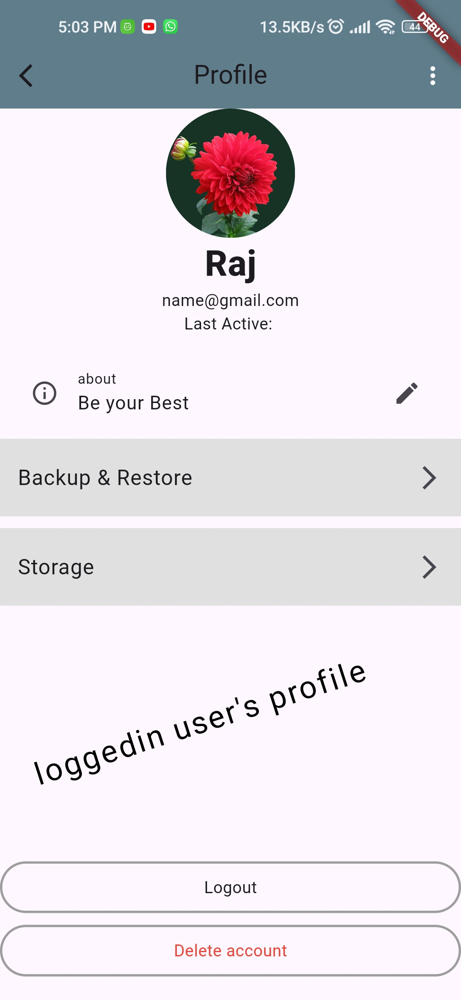

# ChitChat Messenger


Welcome to **ChitChat Messenger**, your ultimate chat application for seamless communication. Built with Flutter and Firebase, ChitChat offers a robust and user-friendly platform for staying connected with friends and family.

## Features

### Authentication
- **Email & Password Authentication**: Securely register and log in using your email address and password.
- **Google Sign-In**: Quick and easy authentication with your Google account.

### User Profile
- **Profile Picture**: Upload and update your profile picture seamlessly.
- **User Details**: View and edit your username and email.

### Chat Functionality
- **Real-time Messaging**: Send and receive messages in real time.
- **Firestore Integration**: Messages are stored and retrieved from Firebase Firestore.
- **User Presence**: See when your friends are online and their last active time.

### Media Sharing
- **Image Upload**: Share images with your contacts directly from your device.
- **Firebase Storage**: Uploaded images are stored securely in Firebase Storage.

### User Interface
- **Elegant UI**: Enjoy a sleek and modern user interface.
- **Responsive Design**: Optimized for both mobile and tablet screens.

## Screenshots

*Login Screen: Secure login with email or Google account.*


*Register Screen: Create a new account with ease.*


*Chat Screen: Real-time messaging with friends.*


*Profile Screen: View and update your profile details.*


## Getting Started

### Prerequisites
- **Flutter**: Make sure you have Flutter installed on your machine. You can follow the installation guide [here](https://flutter.dev/docs/get-started/install).
- **Firebase**: Set up a Firebase project and integrate it with your Flutter app. Refer to the official documentation [here](https://firebase.google.com/docs/flutter/setup).

### Installation

1. **Clone the Repository**
   ```bash
   git clone https://github.com/yourusername/chitchat-messenger.git
<<<<<<< HEAD
   cd chitchat-messenger
=======
   cd chitchat-messenger
>>>>>>> 0b86b8c (readme.mg updated)
